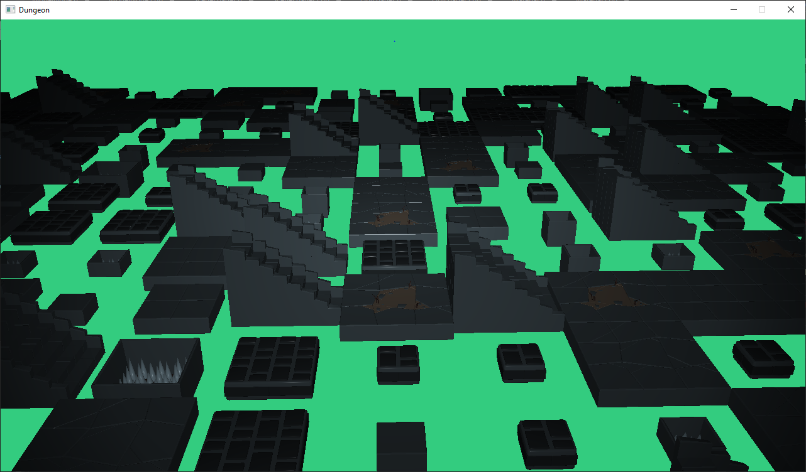

# TinySDLEngine
#### A small SDL- and OpenGL-based game engine currently in progress.

## Setup
Wrap the contents of this project inside a folder named `TinySDLEngine` (if downloading as ZIP, just unzip and rename `TinySDLEngine-master`) and
move it into another empty folder, such that the contents are now inside `<new folder>/TinySDLEngine`.
Move `TinySDLEngine.sln_` (now in `<new folder>/TinySDLEngine`) into the new folder and rename it to `TinySDLEngine.sln`.
Start the project in Visual Studio by opening the `TinySDLEngine.sln` file.

## Support
Currently, only the MSVC compiler is supported.
Make sure to set the Visual Studio configuration to `Debug` and the platform to `x64`.

## Running the program
The first (and only) thing you will see right now is a placeholder scene with a bunch of 3D models.
You can move freely with the mouse and the WASD or the arrow keys. To quit the game, press the ESC key (note: the mouse is captured by the application).

